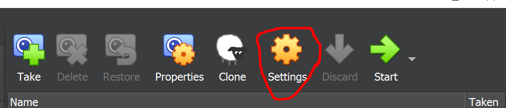
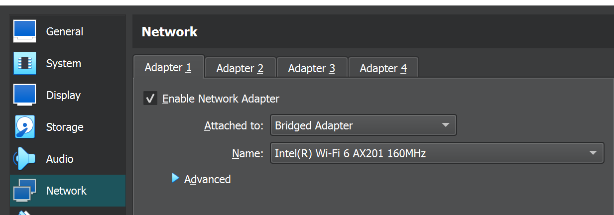

# 🧠 VirtualBox Master 🤖 & Workers 👾👾 Setup

  

---

## 🎯 Goal

Set up a local VM-based Kubernetes environment by first creating the Master node, then cloning or replicating it for Worker nodes using VirtualBox and Ubuntu Server 22.04.

---

## 🪛 What You’ll Do

* ✅ Create 1 master and 2 worker VMs
* ✅ Configure network bridging so your VMs can talk to each other and the internet
* ✅ Allocate CPU, RAM, and storage resources appropriately
* ✅ Share folders for convenient file access

---

## 🧱 Step-by-Step VM Creation

### 🔽 0. Download Ubuntu Server

Download Ubuntu 22.04 ISO from the official site: 

---

### 🧰 1. Open VirtualBox > Click "New"

Give your VM a name and choose a directory for storage.

---

### 🧠 2. Set Name & Location

Choose a clear name like `k8s-master` and select your desired storage location.

---

### 🧠 3. Assign CPU & Memory

Recommend: 2 CPUs and 2048 MB RAM

---

### 💾 4. Configure Disk Size

* Master Node: 20 GB
* Worker Nodes: 50 GB each

---

### 🔌 5. Power Off VM to Configure Network

After creating the VM, shut it down before modifying the settings.

---

### ⚙️ 6. Open VM Settings

Click on your VM > Settings

---

### 🌐 7. Configure Network to "Bridged Adapter"

Ensures the VM gets a LAN IP address and internet access.

---

### 📡 8. Choose Correct Network Interface

Use `ipconfig /all` on Windows to confirm your active network interface (e.g., Intel(R) Wi-Fi 6 AX201).

---

### 📁 9. (Optional) Enable Shared Folders

Mount local folders to transfer bash scripts or configs easily.

---

### 💾 10. Save All Settings

Make sure all changes are applied before booting the VM.

---

## ⏭️ Continue To...

### 👉 [Ubuntu Installation 🐧](../2.%20Ubuntu%20Installation/README.md)

Let’s install the OS and prepare it for Kubernetes! 🛠️
