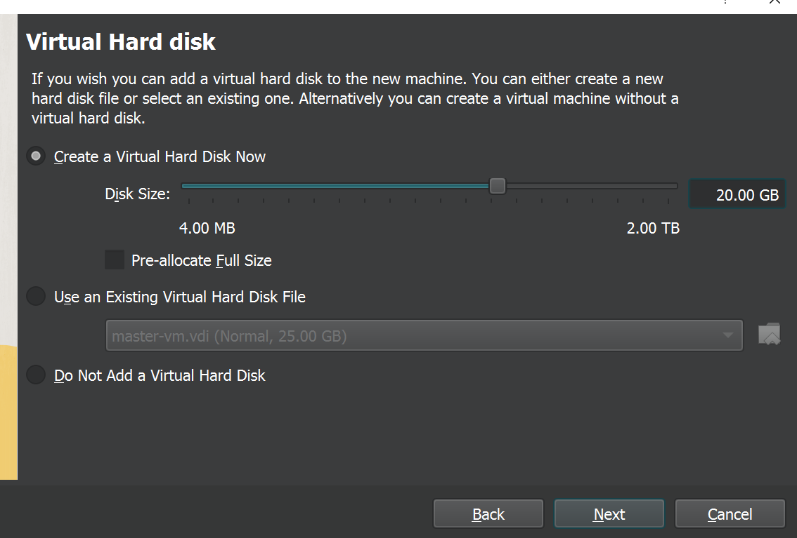
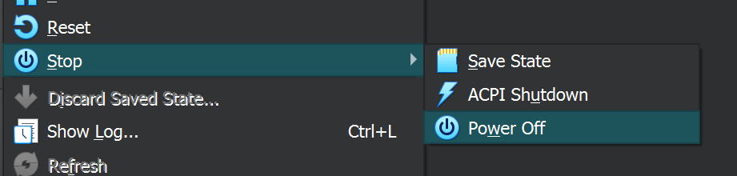

# VirtualBox Master🤖 Workers👾👾 Setup.

<h1>Create virtual machines</h1>
<h4>Let’s create virtual machines. I will describe the scenario for master node and you can create 2 worker nodes by yourself.</h4>
<h4>First, download required images. You can use the following icon  to download Ubuntu iso image.</h4>

# <h4>1.  Open VirtualBox and choose “New†to start configuration.</h4> 

# <h4>2. In the opening form type new virtual machine name and choose the path where VM data will be stored.</h4>

# <h4>3.  Now press “Next†and configure CPU and memory resources. I would suggest at least 2 CPU and 2G RAM.</h4>

# <h4>4.  Configuration of disk space resources. For master node we will set 20GB disk and 50GB for each worker node </h4>

<h4>Press “Next” and finish set up.</h4>

# <h4>5.  Shutdown the new create vm to configure network</h4>

# <h4>6.  Choose “Settings”</h4>

# <h4>7. Go to “Network” and choose “Bridge Adapter” as a network interface. With this option your virtual machine will be in the same network as you computer and will get access to internet</h4>

# <h4>8. I chose network interface "Intel(R) Wi-Fi 6 AX201 160MHz". Let’s check such interface exists in my network run ipconfig /all. My desktop is running on Windows 10</h4>

# <h4>9. I also suggest to configure a shared folder, because it’s very helpful to use bash scripts during setup</h4>

<h4>10. Now save all your settings</h4>

# Continue

[   ][PlDa]

[PlDa]:<../2. Ubuntu Installation/README.md>

