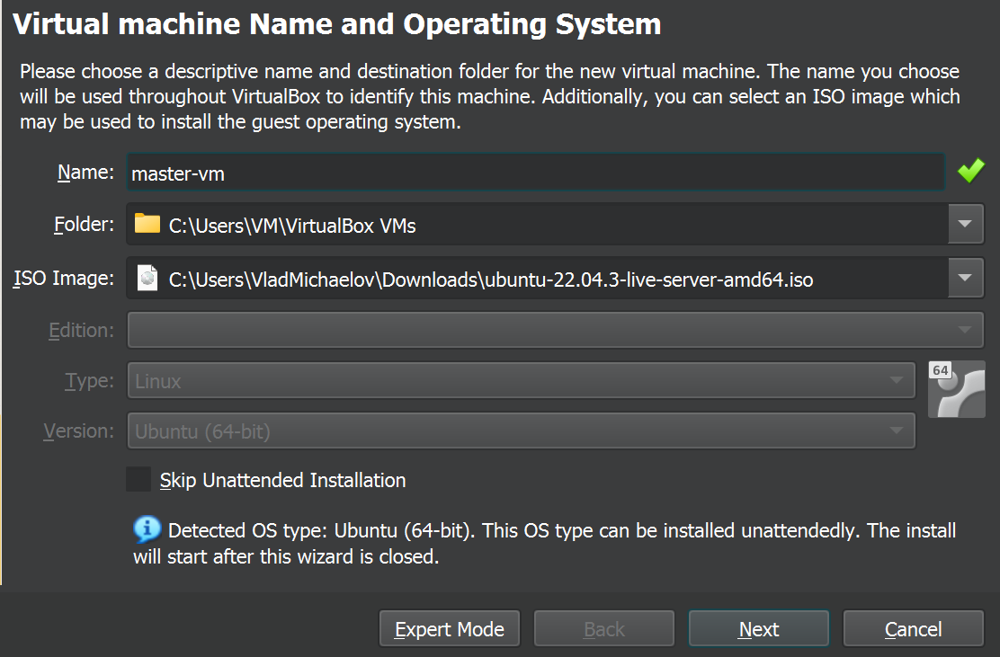
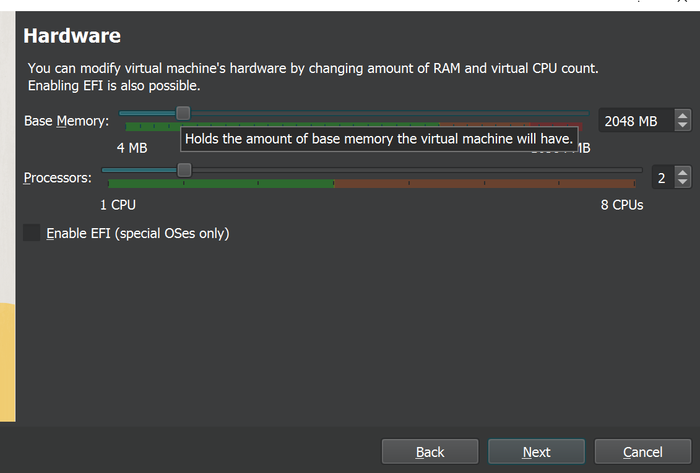

<h1>Create virtual machines</h1>
<h3>Let’s create virtual machines. I will describe the detailed scenario for master node and you can create 2 worker nodes by yourself.</h3>
<h3>First, download required images. You can use the following link https://ubuntu.com/download/server to download Ubuntu iso image. </h3>

# <h4>1. Open VirtualBox and choose “New” to start configuration.</h4> 

# <h4>2. In the opening form type new virtual machine name and choose the path where VM data will be stored.</h4>

# <h4>3. Now press “Next” and configure CPU and memory resources. I would suggest at least 2 CPU and 2G RAM.</h4>

# <h4>4. Configuration of disk space resources. For master node we will set 20GB disk and 50GB for each worker node </h4>

