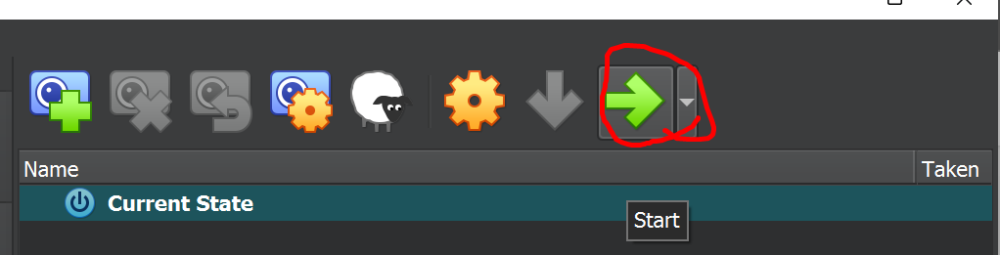
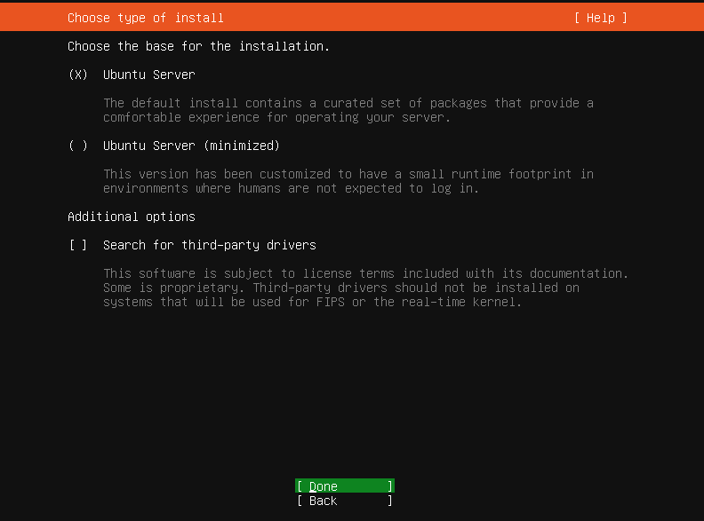
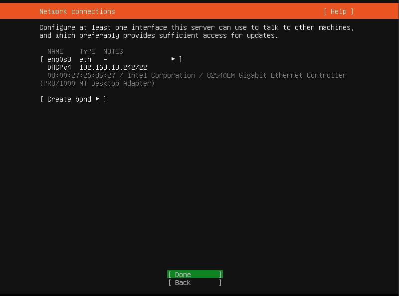
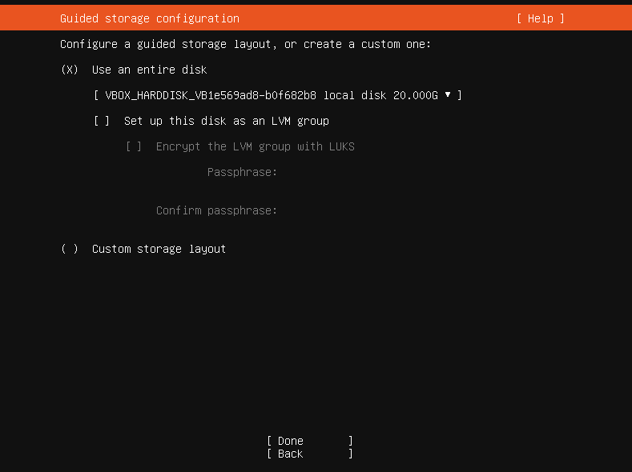
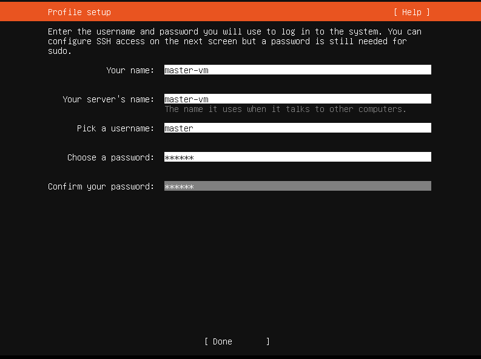
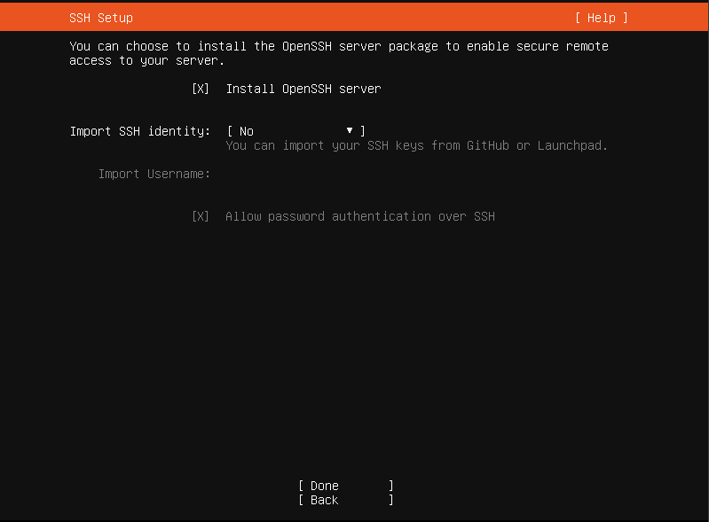

# 🐧 Ubuntu Server 22.04.3 Installation Guide

  

---

## ⚙️ Step-by-Step Installation

### 1️⃣ Start your Virtual Machine

Power up the VM you created in VirtualBox. Make sure the ISO is mounted.



---

### 2️⃣ Begin Ubuntu Server Installation

You'll see the Ubuntu installation screen. Follow the wizard to begin setup.



---

### 3️⃣ IP Address via Bridge Adapter

Ubuntu will obtain a bridged IP (e.g., `192.168.x.x`) so it lives on the same network as your host.



---

### 4️⃣ Skip LVM Group Setup

LVM is optional; for simplicity, you can skip it unless you have advanced needs.



---

### 5️⃣ Set Username, Password & Hostname

Choose a meaningful username, secure password, and a unique machine name (e.g., `k8s-master`).



---

### 6️⃣ Optional: Install OpenSSH

This lets you connect via SSH. Highly recommended! 🔐



---

### 7️⃣ Wait for Installation to Complete ⏳

Sit back and relax while Ubuntu gets installed. Once prompted, reboot your machine.

---

## ✅ Post-Install Checks

After the reboot, login with the credentials you created and run the following:

### 🧪 Verify Host Connectivity

```bash
ping <your-host-IP>
```

### 🌐 Test Internet Access

```bash
curl www.google.com
```

### 📡 Check Network Interfaces

```bash
ip a
```

If all tests pass ✅✅✅, your VM is ready for the next step!

---

## ⏭️ Continue To...

### 🐳☸️ [Kubernetes & Docker Setup](../3.%20Kubernetes%20Installation/README.md)

Let’s install Docker and Kubernetes and turn this VM into a container powerhouse!

---
