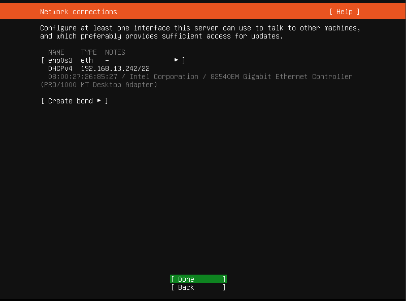
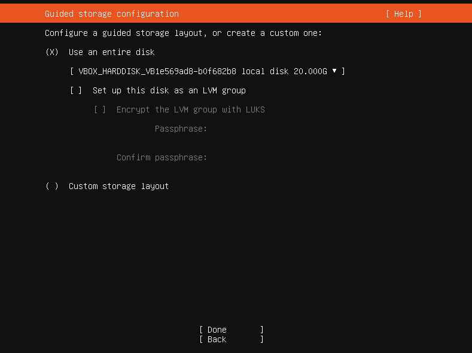

# Ubuntu Server 22.04.3 installation

# <h4>Start your virtual machine.</h4>

# <h4>installe Ubuntu Server</h4>

# <h4>Bridge network adapter generated IP 192.168.13.242 for new VM</h4>

# <h4>There is no need to use LVM groups, so you can skip it</h4>

# <h4>Choose you username/password and server name</h4>

# <h4>You can also install OpenSSH to connect to your virtual machine by ssh</h4>

# <h4>Now proceed with installation and wait⏳ until Ubuntu is successfully installed on your virtual machine</h4>

# <h4>Finally🥳, installer will ask you to reboot your machine, so after restart login and let’s check that everything goes right way</h4>

# Check Ubuntu installation.
Check access to you local computer from master node 

     ping <Localhost IP>
 
Check access to internet on your master node 

     curl www.google.com
      
Finally, you can check available network interfaces. 

    ip a 
 

<h4> If all checks were successfully passed you are ready to install docker and kubernetes on your virtual machine</h4>

# [Continue to K8s Installation][PlDa]
[PlDa]:<../3. Kubernetes Installation/README.md>

