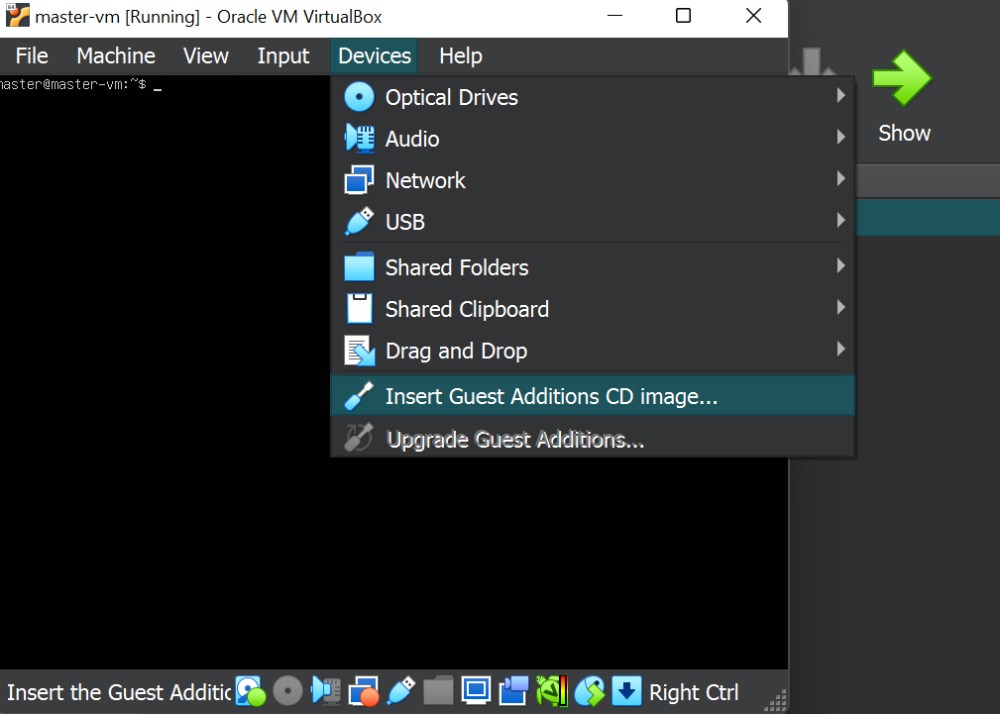

# <a href="https://kubernetes.io/" target="_blank"></a> Kubernetes Setup

<h3> Configure share folder</h3>

<h4>1. First of all go to Devices -> Insert Guest Additions CD image </h4>

<br>

<h4>2. after Inserting Guest Additions CD image</h4>

From the terminal, run the following commands:

```sh
sudo su
apt install bzip2
apt install gcc make 
mkdir --parents /media/cdrom
mount /dev/cdrom /media/cdrom
/media/cdrom/VBoxLinuxAdditions.run
reboot
```
Your share folder  will be in /media/sf<your_folder>

# <h4>3. Disable Swap</h4>

```sh
sudo sed -i '/\sswap\s/s/^/#/' /etc/fstab
sudo swapoff -a
free -h
```
<h4>Should look like this</h4>


# <h4>4. Install kubernetes  </h4>
<h4>Now it’s time to install kubernetes itself on the master node. I made my cluster set up for 1.25.4 version</h4>
<h4>I’m going to put all required commands to k8s.sh file to run it in master node, and worker nodes after all</h4>

```sh
# k8s.sh
sudo apt-get update
sudo apt install curl apt-transport-https -y
curl -fsSL  https://packages.cloud.google.com/apt/doc/apt-key.gpg|sudo gpg --dearmor -o /etc/apt/trusted.gpg.d/k8s.gpg
curl -s https://packages.cloud.google.com/apt/doc/apt-key.gpg | sudo apt-key add -
echo "deb https://apt.kubernetes.io/ kubernetes-xenial main" | sudo tee /etc/apt/sources.list.d/kubernetes.list
sudo apt update
sudo apt install kubelet=1.25.4-00 kubeadm=1.25.4-00 kubectl=1.25.4-00 -y
sudo apt-mark hold kubelet kubeadm kubectl
```
# <h4>Check your installation</h4>

```sh
kubectl version --output=yaml
kubeadm version --output=yaml
```
# <h4>5. Install docker </h4>

<h4>I’m going to use Docker as a container runtime for kubernetes in my cluster</h4>
<h4>To make in complaint with kubernetes I will use Mirantis. It’s an adapter for Docker Engine to implement CRI interfaces</h4>
<h4>Mirantis Documentation: https://docs.mirantis.com/welcome/</h4>

```sh
#docker.sh
sudo apt update
sudo apt install -y curl gnupg2 software-properties-common apt-transport-https ca-certificates
curl -fsSL https://download.docker.com/linux/ubuntu/gpg | sudo apt-key add -
sudo add-apt-repository "deb [arch=amd64] https://download.docker.com/linux/ubuntu $(lsb_release -cs) stable"
sudo apt update
sudo apt install -y containerd.io docker-ce docker-ce-cli

sudo mkdir -p /etc/systemd/system/docker.service.d

sudo tee /etc/docker/daemon.json <<EOF
{
  "exec-opts": ["native.cgroupdriver=systemd"],
  "log-driver": "json-file",
  "log-opts": {
    "max-size": "100m"
  },
  "storage-driver": "overlay2"
}
EOF
```

# <h4>Check your installation</h4>

```sh
docker --version
```

# <h4>6. To finish Docker setup for kubernetes let’s install Mirantis</h4>

```sh
#mirantis.sh
VER=$(curl -s https://api.github.com/repos/Mirantis/cri-dockerd/releases/latest|grep tag_name | cut -d '"' -f 4|sed 's/v//g')
echo $VER

wget https://github.com/Mirantis/cri-dockerd/releases/download/v${VER}/cri-dockerd-${VER}.amd64.tgz
tar xvf cri-dockerd-${VER}.amd64.tgz

sudo mv cri-dockerd/cri-dockerd /usr/local/bin/

wget https://raw.githubusercontent.com/Mirantis/cri-dockerd/master/packaging/systemd/cri-docker.service
wget https://raw.githubusercontent.com/Mirantis/cri-dockerd/master/packaging/systemd/cri-docker.socket
sudo mv cri-docker.socket cri-docker.service /etc/systemd/system/
sudo sed -i -e 's,/usr/bin/cri-dockerd,/usr/local/bin/cri-dockerd,' /etc/systemd/system/cri-docker.service

sudo systemctl daemon-reload
sudo systemctl enable cri-docker.service
sudo systemctl enable --now cri-docker.socket
```

# <h4>Check your installation</h4>

```sh
cri-dockerd --version
systemctl status cri-docker.socket
```

# <h4>7. Configure Kubernetes prerequisites.</h4>
<h4>Documentation: https://kubernetes.io/docs/setup/production-environment/container-runtimes/</h4>

I created prerequisites.sh based on documentation

```sh
#prerequisites.sh
sudo tee /etc/modules-load.d/k8s.conf <<EOF
overlay
br_netfilter
EOF

sudo modprobe overlay
sudo modprobe br_netfilter

sudo tee /etc/sysctl.d/kubernetes.conf<<EOF
net.bridge.bridge-nf-call-ip6tables = 1
net.bridge.bridge-nf-call-iptables = 1
net.ipv4.ip_forward = 1
EOF

sudo sysctl --system
```

# <h4>8. Run the script and check setup was correctly applied.</h4>

```sh
lsmod | grep br_netfilter
lsmod | grep overlay
sysctl net.bridge.bridge-nf-call-iptables net.bridge.bridge-nf-call-ip6tables net.ipv4.ip_forward
```

# <h4>9. Setup worker nodes 👾👾</h4>

<h4>Master node setup is completed and it’s time to create a cluster. However, it would be better to configure worker nodes on this step before going further.</h4>
  
```sh
I created 2 worker nodes

worker-1
worker-2 
  
following the same steps as for master node.
```

# Continue

# [ 👾👾][PlDb]

[ ][PlDa]


[PlDb]:<../1. Virtual Machines/README.md>
[PlDa]:<../4. Cluster Installation/README.md>
