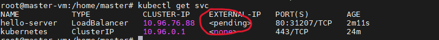

#  Metallb Setup

Metallb Documentation: https://metallb.universe.tf/


# <h4> Setup a MetalLB Load Balancer on a on-premises Kubernetes Cluster</h4>

Without MetalLB or any similar software solution the External IP of any new created service in Kubernetes will stay indefinitely in pending state. MetalLB’s purpose is to cover this deficit by offering a network load balancer implementation that integrates with standard network equipment, so that external services on bare-metal clusters work in a similar way as their equivalents in IaaS platform providers.

<h4>  Example Try:</h4>

```sh
kubectl create deployment hello-server --image=gcr.io/google-samples/hello-app:1.0
kubectl expose deployment hello-server --type LoadBalancer --port 80 --target-port 8080
kubectl get svc
```
# <h4> output</h4>


# 1. <h4> Installation</h4>
The installation of MetalLB is easy we are going to perform it by applying the necessary manifests (everything will be provisioned in a new namespace named metallb-system)


```sh
kubectl apply -f https://raw.githubusercontent.com/metallb/metallb/v0.13.7/config/manifests/metallb-native.yaml
```
we need to provide the components required by MetalLB. The next manifest will deploy MetalLB to the cluster, in metallb-system namespace we just created. The components are:

```sh
1. the metallb-system/controller deployment. A cluster-wide controller that handles IP assignments.
2. the metallb-system/speaker which is a daemonset. That is the component to make the services reachable.
3. the service accounts for the controller and speaker, along with the RBAC permissions that the components require.
```

```sh
kubectl get all --namespace metallb-system
```
<h4> Output should be similler to this:</h4>h4>


The installation manifest does not include a configuration file. MetalLB’s components although will start, they will remain idle until we provide the required configuration as an IpAddressPool.

<h4>2.  Let’s name it ipaddresspool.yaml:</h4>

```sh
apiVersion: metallb.io/v1beta1
kind: IPAddressPool
metadata:
  name: default-pool
  namespace: metallb-system
spec:
  addresses:
  - 192.168.13.240-192.168.13.250
```
We are going to use Layer 2 configuration:

Documentation:
Layer 2 mode does not require the IPs to be bound to the network interfaces of your worker nodes. It works by responding to ARP requests on your local network directly, to give the machine’s MAC address to clients.

In this example I am going to bind MetalLB with the addresses from192.168.13.240 to 192.168.13.250 of my home network.

IMPORTANT❗: Make sure you exclude this slice from the address pool of your DHCP server, otherwise you will run into troubles.

create an additional manifest and provision an object of type L2Advertisement

3.  Let’s name it l2advertisement.yaml:

```sh
apiVersion: metallb.io/v1beta1
kind: L2Advertisement
metadata:
  name: default
  namespace: metallb-system
spec:
  ipAddressPools:
  - default-pool
```

4. Now let’s deploy these manifests:

```sh
kubectl apply -f ipaddresspool.yaml
kubectl apply -f l2advertisement.yaml
```
# <h4> Take it for a test</h4>

```sh
# Remove old deployment and service.
kubectl delete deployment hello-server
kubectl delete svc hello-server
kubectl get svc

# Create new

kubectl create deployment hello-server --image=gcr.io/google-samples/hello-app:1.0
kubectl expose deployment hello-server --type LoadBalancer --port 80 --target-port 8080
kubectl get svc
```

 Output:


 let’s scale our deployment in order to see the load-balancing effect clearer

 ```sh
kubectl scale --replicas=3 deployment nginx-server
```

Let’s try to call the load-balanced endpoint now:

```sh
for i in {1..5}; do curl http://192.168.13.247; done
```

 Output:


<h3> Check out how the requests are load-balanced among our 3 pods!</h3>

 # [   ][PlDa]
 [PlDa]:<../6. Nginx Ingress Controller setup/README.md>
