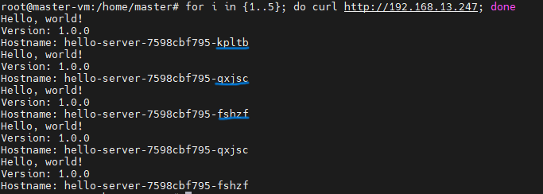

# 🧱 MetalLB Setup Guide

  
📄 [MetalLB Documentation](https://metallb.universe.tf/)

---

## 📌 Why MetalLB?
  
Without MetalLB, services of type `LoadBalancer` stay in `pending` state on bare-metal clusters. MetalLB solves this by handling IP allocation and external access.

---

## 🧪 Test It First (Pre-MetalLB)

```bash
kubectl create deployment hello-server --image=gcr.io/google-samples/hello-app:1.0
kubectl expose deployment hello-server --type LoadBalancer --port 80 --target-port 8080
kubectl get svc
```

📸 Example Output:  


---

## 🔧 Step 1: Install MetalLB

Apply MetalLB manifests:

```bash
kubectl apply -f https://raw.githubusercontent.com/metallb/metallb/v0.13.7/config/manifests/metallb-native.yaml
```

Check deployment:

```bash
kubectl get all -n metallb-system
```

📸 Output:  


---

## 🗂️ Step 2: Configure IP Address Pool

Create `ipaddresspool.yaml`:

```yaml
apiVersion: metallb.io/v1beta1
kind: IPAddressPool
metadata:
  name: default-pool
  namespace: metallb-system
spec:
  addresses:
  - 192.168.13.240-192.168.13.250
```

⚠️ Make sure these IPs are not managed by DHCP!

---

## 📢 Step 3: L2Advertisement

Create `l2advertisement.yaml`:

```yaml
apiVersion: metallb.io/v1beta1
kind: L2Advertisement
metadata:
  name: default
  namespace: metallb-system
spec:
  ipAddressPools:
  - default-pool
```

Apply both manifests:

```bash
kubectl apply -f ipaddresspool.yaml
kubectl apply -f l2advertisement.yaml
```

---

## 🧪 Step 4: Test LoadBalancer Type Again

Clean up previous test:

```bash
kubectl delete deployment hello-server
kubectl delete svc hello-server
kubectl get svc
```

Deploy and expose again:

```bash
kubectl create deployment hello-server --image=gcr.io/google-samples/hello-app:1.0
kubectl expose deployment hello-server --type LoadBalancer --port 80 --target-port 8080
kubectl get svc
```

📸 Output:  


---

## ⚖️ Step 5: Scale Deployment & Test Load Balancing

```bash
kubectl scale --replicas=3 deployment nginx-server
```

Test load-balanced endpoint:

```bash
for i in {1..5}; do curl http://192.168.13.247; done
```

📸 Output:  


💡 Watch as requests rotate across the 3 pods!

---

## ⏭️ Continue

👉 [Next: NGINX Ingress Controller Setup](../6.%20Nginx%20Ingress%20Controller%20setup/README.md)
