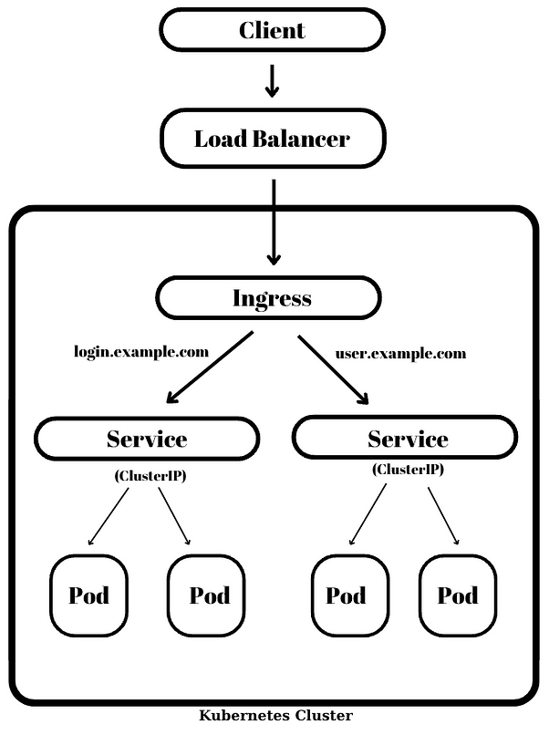
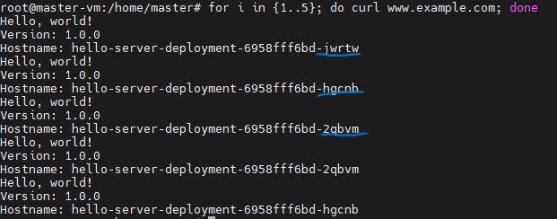

#  Nginx Ingress Controller Setup

Nginx Documentation: https://docs.nginx.com/nginx-ingress-controller/<br>
<br>


1. Let’s define a namespace named ingress-nginx where Deployment and Ingress Controller will work together


```sh
kubectl create namespace ingress-nginx
```
2.  Let’s create a backend deployment

```sh
#deployment.yaml

apiVersion: apps/v1
kind: Deployment
metadata:
  name: hello-server-deployment
  namespace: ingress-nginx
spec:
  selector:
    matchLabels:
      app: hello-server
  replicas: 4
  template:
    metadata:
      labels:
        app: hello-server
    spec:
      containers:
        - name: hello-server
          image: gcr.io/google-samples/hello-app:1.0
          ports:
            - containerPort: 8080
```
3.  Lets create an Ingress:

```sh
# ingress.yaml

apiVersion: networking.k8s.io/v1
kind: Ingress
metadata:
  name: nginx-ingress-example
  namespace: ingress-nginx
  annotations:
    nginx.ingress.kubernetes.io/rewrite-target: /
spec:
  rules:
    - host: www.example.com
      http:
        paths:
          - path: /
            pathType: Prefix
            backend:
              service:
                name: hello-server
                port:
                  number: 80

```

4.  Lets create a Service:

```sh
#service.yaml

apiVersion: v1
kind: Service
metadata:
  creationTimestamp: null
  labels:
    app: hello-server
  name: hello-server
  namespace: ingress-nginx
spec:
  ports:
  - port: 80
    protocol: TCP
    targetPort: 8080
  selector:
    app: hello-server
  type: LoadBalancer
status:
  loadBalancer: {}

```

5. Map in your /etc/hosts file the domain we choose "www.example.com" to LoadBalancer IP


# <h4> Test Ingress </h4>

```sh
curl www.exaple.com
```

 Output:


```sh
for i in {1..5}; do curl www.example.com; done
```

 Output:



# <h3>🥳🥳Congratulation🥳🥳 You have been created kubernetes cluster on on-premises environment, Deployed Metallb loadbalancer solution and Nginx ingress.</h3>

# <h3>Hope everything went well! Happy Kubernetes-ing on your on-premises infrastructure, just as seamlessly as on IaaS</h3>
