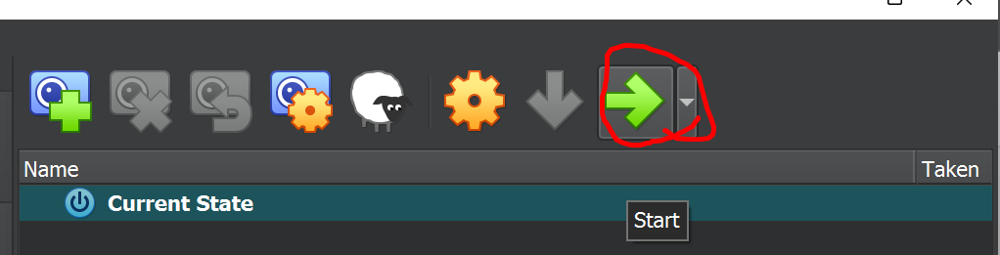

# Ubuntu Server 22.04.3 installation

# Start your virtual machine.

# installe Ubuntu Server

# Bridge network adapter generated IP 192.168.13.242 for new VM

# There is no need to use LVM groups, so you can skip it

# Choose you username/password and server name

# You can also install OpenSSH to connect to your virtual machine by ssh

# Now proceed with installation and wait until Ubuntu is successfully installed on your virtual machine

# <h3> Finally🥳, installer will ask you to reboot your machine, so after restart login and let’s check that everything goes right way</h3>

# Check Ubuntu installation.
Check access to you local computer from master node 

     ping <Localhost IP>
 
Check access to internet on your master node 

     curl www.google.com
      
Finally, you can check available network interfaces. 

    ip a 
 

<h3> If all checks were successfully passed you are ready to install docker and kubernetes on your virtual machine</h3>

# [Continue to K8s Installation][PlDa]
     [PlDa]:<../Kubernetes Installation/

