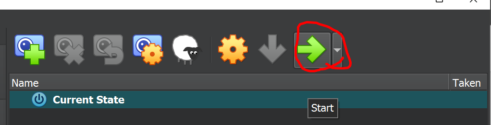
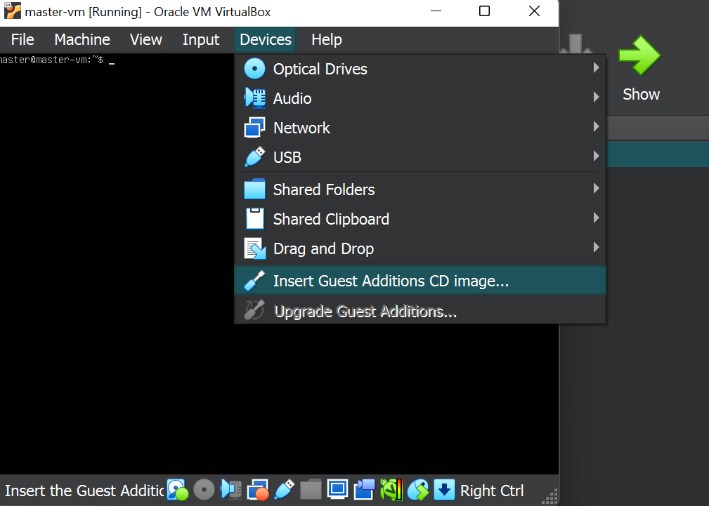

# Ubuntu Server 22.04.3 installation

# Start you virtual machine.

# <h4>From the terminal, run the following commands: 
 
 1. sudo su 
 2. apt install gcc make 
 3. mkdir --parents /media/cdrom 
 4. mount /dev/cdrom /media/cdrom 
 5. /media/cdrom/VBoxLinuxAdditions.run 
 6. reboot</h4>

 test
