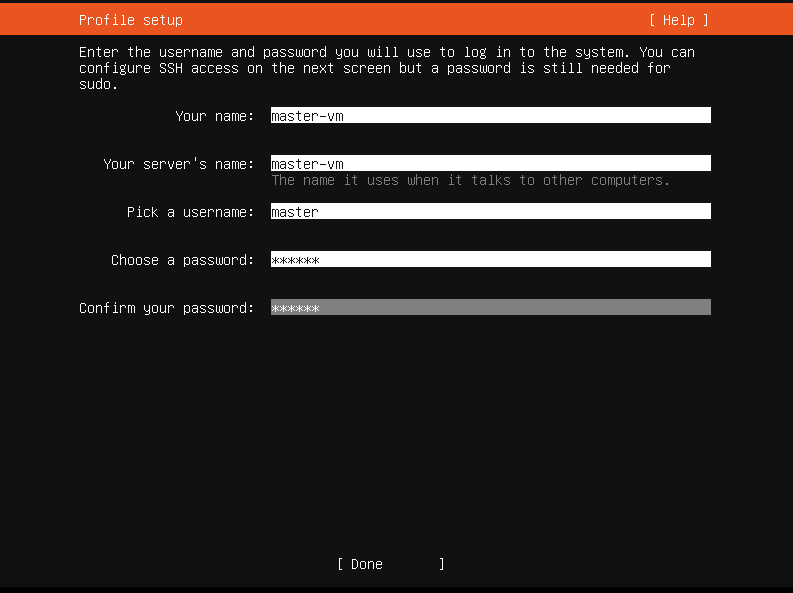

# Ubuntu Server 22.04.3 installation

# Start you virtual machine.

# <h4>installe Ubuntu Server</h4>

# <h4>Bridge network adapter generated IP 192.168.13.242 for new VM</h4>

# <h4>There is no need to use LVM groups, so you can skip it</h4>

# <h4>Choose you username/password and server name</h4>

# <h4>You can also install OpenSSH to connect to your virtual machine by ssh</h4>

# <h4>Now proceed with installation and wait until Ubuntu is successfully installed on your virtual machine<h4>

<h4>From the terminal, run the following commands: 
 
 1. sudo su 
 2. apt install gcc make 
 3. mkdir --parents /media/cdrom 
 4. mount /dev/cdrom /media/cdrom 
 5. /media/cdrom/VBoxLinuxAdditions.run 
 6. reboot</h4>

 test

